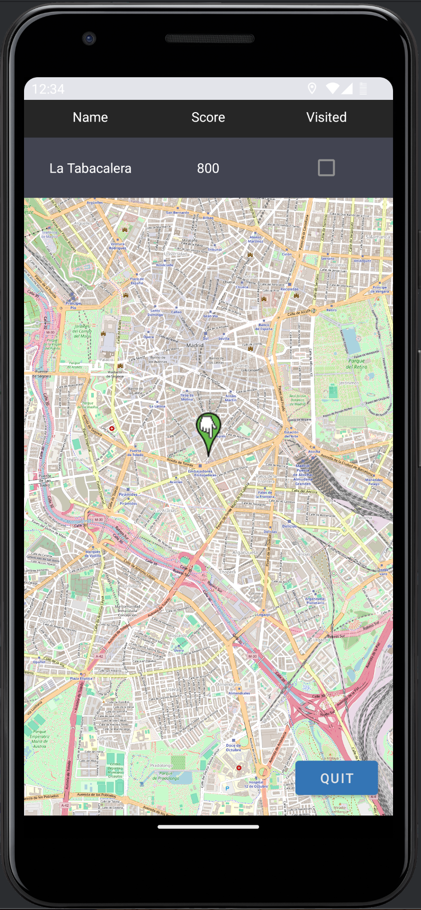

# Madrid'sGraphs

## Workspace 
Github:  
- Repository: https://github.com/AlexisUmp/MADUpm  
- Releases: https://github.com/AlexisUmp/MADUpm/releases  

Workspace: https://upm365.sharepoint.com/sites/MobileAppSite .  
  

## Description
This app is about visiting Madrid in a new way. Indeed, it allows you to discover the marvelous graffiti of the city. Thanks to our application you will be able to stroll around the whole city in a fun way. Every time you find a graffiti listed in the app, you earn points. Compete with your friends and see who has discovered the most graffiti!

## Screenshots and navigation
Include screenshots of the app in action. You can upload the images to GitHub and then reference them here using Markdown or HTML syntax:
<table>
  <tr>
    <td>
      
      
List of all the graffiti in Madrid

    </td>
    <td>
      
      
LoginScreen of the application

    </td>
  </tr>
  <tr>
    <td>
      
      
HomePage where you can access the map, settings and LogIn

    </td>
    <td>
      
      
An example of how a point is represented

    </td>
  </tr>
  <tr>
    <td>
      
      
Here is the API integration with QR codes

    </td>
    <td>
      
      
List of Settings

    </td>
  </tr>
</table>

## Demo Video
https://upm365-my.sharepoint.com/:v:/g/personal/simon_bellegy_alumnos_upm_es/EVzFQGkbSn5Gq482OMrq5fMBFDmD5OcoYcuSLEptnHiLkg?e=9wctRh&nav=eyJyZWZlcnJhbEluZm8iOnsicmVmZXJyYWxBcHAiOiJTdHJlYW1XZWJBcHAiLCJyZWZlcnJhbFZpZXciOiJTaGFyZURpYWxvZy1MaW5rIiwicmVmZXJyYWxBcHBQbGF0Zm9ybSI6IldlYiIsInJlZmVycmFsTW9kZSI6InZpZXcifX0%3D

## Features
**Functional** features of the app:
- Search for graffitis in Madrid.
- Interactive maps.

**Technical** features of the app:
- Persistence in csv/text file
- Persistence in shared preferences
- Maps: Openstreetmaps
- Resful APIs used: zxling (QR Codes)
- Menu: Toolbar
- Sensors: GPS coordinates

## Features
List the **functional** features of the app:
- Search for graffitis in Madrid.
- Interactive maps.

List the **technical** features of the app. You might include specific references to source code
in your repo. For example:
- Persistence in csv/text file
- Persistence in shared preferences
- Maps: Openstreetmaps
- Menu: Toolbar
- Sensors: GPS coordinates 

## How to Use
To use the application, nothing could be simpler. All you have to do is create an account (or you can also play as a guest) and launch the map. You will have the list of all the graffiti to visit in Madrid. You can also see the list of all graffiti and see their location one by one. Once you have visited one, you can check the “visited” box to claim your points.

## Participants
List of MAD developers:
- Simon Bellegy (simon.bellegy@alumunos.upm.es)
- Alexis Blanc-Feuillet (alexis.bfeuillet@alumunos.upm.es)  

